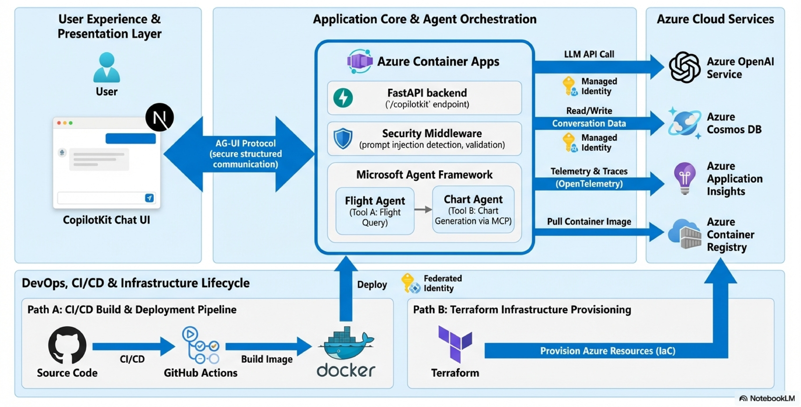

# MAF - AG-UI Azure Agent Template

This repository provides a fully structured template for building AI agent applications on Azure using the Microsoft Agent Framework, AG-UI protocol, CopilotKit UI, and Azure-native services.
The template defines a clear separation between UI orchestration, agent execution, tool integration, and cloud-based observability, enabling teams to adopt agent-driven application architectures with minimal boilerplate.



## 🌟 What is this?

This is a **starter template** for building AI chat applications with:

- **AG-UI Protocol** - Standard protocol for AI agent communication (CopilotKit ↔ Agent Framework)
- **Azure-native** - Built with Azure Services (OpenAI, Cosmos DB, Container Apps, Application Insights, etc.)
- **Agent Workflow** - Multi-agent orchestration with tools and MCP (Model Context Protocol) integration
- **Modern Architecture** - Clean separation of concerns with modular folder structure
- **Production Features** - Auth, persistence, observability, security middleware, CI/CD included

### Demo Use Case

The template demonstrates a simple flight price assistant that:
1. Queries flight prices between cities
2. Generates charts/tables for visualization (via MCP Tools)

> ⚠️ **Architecture Note**: The example uses two agents (Flight → Chart) to illustrate workflow composition.
In real applications, responsibilities can be combined or extended based on system needs.

## ✨ Features

| Category | Features |
|----------|----------|
| **Protocol** | 🔌 AG-UI standard (CopilotKit ↔ Microsoft Agent Framework) |
| **Frontend** | 🎨 CopilotKit Chat UI (Next.js) |
| **Backend** | ⚡ FastAPI + Microsoft Agent Framework |
| **LLM** | 🧠 Azure OpenAI (Managed Identity auth) |
| **Database** | 💾 Azure Cosmos DB (conversation persistence) |
| **Security** | 🛡️ Agent middleware (prompt injection detection, input validation) |
| **Observability** | 📊 OpenTelemetry → Azure Application Insights |
| **Infrastructure** | 🏗️ Terraform (Infrastructure as Code for one-command deployment) |
| **DevOps** | 🐳 Docker Compose (local) + GitHub Actions → Azure Container Registry (CI/CD) |
| **Deployment** | ☁️ Azure Container Apps + Static Web Apps |

## 🏗️ Architecture

<details>
<summary>Click to expand text version</summary>

```
┌─────────────────────────────────────────────────────────────┐
│                    Frontend (Next.js)                        │
│  ┌─────────────────────────────────────────────────────┐    │
│  │              CopilotKit Chat UI                      │    │
│  │         (port 3000)                                  │    │
│  └──────────────────────┬──────────────────────────────┘    │
└─────────────────────────┼───────────────────────────────────┘
                          │ AG-UI Protocol
                          ▼
┌─────────────────────────────────────────────────────────────┐
│                    Backend (FastAPI)                         │
│  ┌─────────────────────────────────────────────────────┐    │
│  │              /copilotkit endpoint                    │    │
│  │         (port 8000)                                  │    │
│  └──────────────────────┬──────────────────────────────┘    │
│                         │                                    │
│  ┌──────────────────────▼──────────────────────────────┐    │
│  │           Microsoft Agent Framework                  │    │
│  │                                                      │    │
│  │  ┌─────────────┐  workflow  ┌─────────────┐         │    │
│  │  │ Flight Agent│ ─────────▶ │ Chart Agent │         │    │
│  │  │  (Tool A)   │            │  (Tool B)   │         │    │
│  │  └─────────────┘            └─────────────┘         │    │
│  │                                                      │    │
│  │  Note: Two agents used to demo workflow feature.     │    │
│  │  Single agent with both tools works too!             │    │
│  └─────────────────────────────────────────────────────┘    │
│                         │                                    │
│  ┌──────────────────────▼──────────────────────────────┐    │
│  │              Azure Cosmos DB                         │    │
│  │         (Conversation Persistence)                   │    │
│  └─────────────────────────────────────────────────────┘    │
└─────────────────────────────────────────────────────────────┘
                          │
                          ▼
┌─────────────────────────────────────────────────────────────┐
│                    Azure Services                            │
│  ┌──────────────┐ ┌──────────────┐ ┌────────────────────┐   │
│  │ Azure OpenAI │ │  Cosmos DB   │ │ Application Insights│   │
│  │   (LLM)      │ │ (NoSQL)      │ │   (Monitoring)      │   │
│  └──────────────┘ └──────────────┘ └────────────────────┘   │
└─────────────────────────────────────────────────────────────┘
```

</details>

## 📁 Project Structure

```
maf/
├── main.py                     # FastAPI entry point
├── src/
│   ├── services/               # 🧠 Core business logic
│   │   ├── agent.py            #    Agent definitions & CopilotKit integration
│   │   ├── tools.py            #    Tool implementations (flight query, chart)
│   │   └── workflow.py         #    Multi-agent workflow orchestration
│   ├── db/                     # 💾 Database layer
│   │   ├── cosmos.py           #    Cosmos DB connection (Azure Identity)
│   │   └── cosmos_chat_store.py#    Chat message persistence for Agent Framework
│   ├── schemas/                # 📋 Data models (Pydantic)
│   │   └── flight.py           #    Flight data schema
│   ├── middleware.py           # 🛡️ Security middleware (prompt injection detection)
│   └── exceptions.py           # ⚠️ Global exception handling
├── tests/                      # 🧪 Unit tests (pytest)
├── frontend/                   # 🎨 Next.js + CopilotKit
│   └── src/app/
│       ├── layout.tsx          #    App layout with CopilotKit provider
│       ├── page.tsx            #    Chat UI component
│       └── api/copilotkit/     #    API route (proxy to backend via AG-UI)
├── terraform/                  # 🏗️ Infrastructure as Code
│   ├── main.tf                 #    Azure resource definitions
│   ├── variables.tf            #    Configurable variables
│   ├── outputs.tf              #    Resource outputs (URLs, keys, etc.)
│   └── README.md               #    Terraform usage guide
├── docker-compose.yml          # 🐳 Local development (one command)
└── Dockerfile                  # 📦 Backend container
```

## 🚀 Quick Start

### Prerequisites

- Python 3.13 + [uv](https://docs.astral.sh/uv/)
- Docker & Docker Compose
- Azure CLI (`az login`)
- Azure OpenAI resource

### 1. Clone and Configure

```bash
git clone https://github.com/xxyckiki/MAF-AGUI-Azure-Template.git
cd MAF-AGUI-Azure-Template

# Copy environment variables
cp .env.example .env

# Edit .env with your Azure OpenAI settings
```

### 2. Start with Docker Compose

```bash
docker-compose up --build
```

This starts:
- Backend: http://localhost:8000
- Frontend: http://localhost:3000

### 3. Open the App

Visit http://localhost:3000 and start chatting!

## 💻 Development

### Backend

```bash
uv sync                              # Install dependencies
uv run uvicorn main:app --reload     # Run server
uv run pytest -v                     # Run tests
```

### Frontend

```bash
cd frontend
npm install --legacy-peer-deps       # Install dependencies
npm run dev                          # Run dev server
```

## ☁️ Azure Deployment

### Option 1: Terraform (Recommended - One Command Deployment)

Deploy entire infrastructure with Terraform:

```bash
cd terraform

# Configure variables
cp terraform.tfvars.example terraform.tfvars
# Edit terraform.tfvars with your subscription ID

# Deploy
terraform init
terraform plan
terraform apply

# Get all configuration values (API keys, endpoints, etc.)
terraform output
```

See [terraform/README.md](terraform/README.md) for detailed instructions.

### Option 2: Manual Deployment

This template can also be deployed manually using Azure Portal or CLI.

### Azure Resources

| Component | Azure Service | Auth |
|-----------|---------------|------|
| Backend | Container Apps | Managed Identity |
| Frontend | Static Web Apps | - |
| Container Registry | Azure Container Registry | Admin / Managed Identity |
| LLM | Azure OpenAI | Managed Identity |
| Database | Cosmos DB (NoSQL) | Key or Managed Identity |
| Monitoring | OpenTelemetry → Application Insights | Connection String |
| CI/CD | GitHub Actions | Federated Identity |

## 📚 Tech Stack

- **[Microsoft Agent Framework](https://github.com/microsoft/agent-framework)** - AI Agent orchestration
- **[CopilotKit](https://copilotkit.ai)** - React chat UI + AG-UI protocol
- **[FastAPI](https://fastapi.tiangolo.com)** - Python web framework
- **[Next.js](https://nextjs.org)** - React framework
- **[Azure OpenAI](https://azure.microsoft.com/products/ai-services/openai-service)** - LLM backend
- **[Azure Cosmos DB](https://azure.microsoft.com/products/cosmos-db)** - NoSQL database
- **[OpenTelemetry](https://opentelemetry.io)** - Observability

## 📄 License
Apache 2.0
